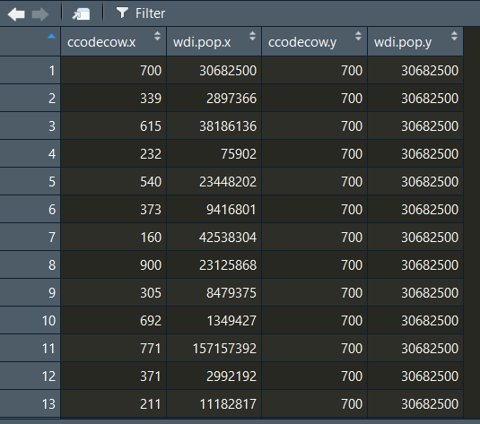
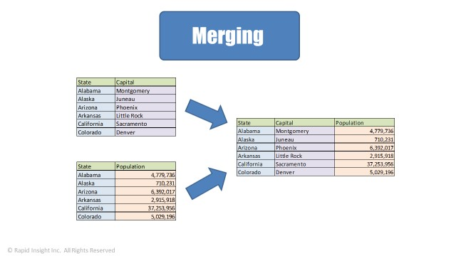

# Introduction to Data {#ch3}

여기에서는 자료를 관리하고 다루는 방법들에 대해 간단한 소개를 하고자 합니다. 구체적으로 다룰 내용들은 다음과 같습니다.

  + 무작위 추출 (Random draws)
  + 루프 (Loops)
  + 히스토그램 (Histograms)
  + 표 (Tables)
  + 벡터에서 요소들을 만들고, 계산하고, 추출하는 법 (Creating, summing, pulling elements from vectors)
  + 분포와 확률에 따라 사고하는 법

먼저, 시작하기에 앞서서 작업 디렉토리 (Working Directory)를 설정할 필요가 있습니다.

## 작업 디렉토리 설정

기본적으로 **R**은 설치할 때, 기본 설정된 폴더에 이어서 작업을 진행합니다. 이 경우 기존에 만들어놓은 `R.data` (**R** 파일 확장자)들을 불러들여서 Global Environment에 사용하지 않을 데이터들이 쌓이게 됩니다. 그러면 현재 작업하여 저장한 새로운 객체들과 기존 디렉토리에 상존하는 데이터들이 혼재되어 헷갈릴 수 있습니다. 

그리고 어차피 연구를 진행하면 해당 프로젝트에 따르는 폴더들을 만들어서 별개로 진행해야할 필요가 있기 때문에, 애초에 연구에 필요한 R.data를 만들 때 그 폴더에 만들고 작업 디렉토리도 설정하는 게 마음 편합니다.

그럼 일단 작업 디렉토리를 확인하고, 변경하는 코드를 살펴보겠습니다.

```{r, include = FALSE, echo = FALSE}
knitr::opts_chunk$set(error = FALSE, warning = FALSE, message = FALSE,
                      fig.height = 3, fig.width = 6, fig.align = 'center')
```

```{r, eval = FALSE}
getwd() #현재 R이 인식하고 있는 작업 디렉토리가 어딘지 알려준다.
setwd("C:/Users/phere") #원하는 장소로 디렉토리를 변경한다.
```

기서 주의해야 할 것은, 디렉토리 주소를 적을 때에는 반드시 `""` 기호를 사용해야 한다는 것입니다. 그리고 아마 윈도우 PC는 `/`로 디렉토리를 구분하는 반면에 MAC OS의 경우는 `\`(back slash)를 사용하는 것으로 알고 있습니다. 

나중에 한 번 다루긴 하겠지만 몇 가지 함수들의 경우에는 MAC에서는 오류가 안 생기는데 윈도우에서는 오류가 발생하는 것들이 있습니다. 그런 경우가 조금 번거로울 때가 있기는 한데, 그 이외에는 뭐 다 같은 컴퓨터에 같은 **R**이니 큰 불편함은 없다고 할 수 있습니다 (하지만 MAC 구매 뽐뿌가 오는 것은 사실입니다).

```{r, eval = FALSE}
dir.create(path= "figures")
dir.create(path= "tables")
dir.create(path= "datasets")
dir.create(path= "references")
dir.create(path= "tex")
```

저 같은 경우에는 어떤 연구 프로젝트를 시작할 때, 제일 먼저 R-script 빈 것을 만들어두고 작업 디렉토리를 설정합니다. 

  + 이후에 위의 코드와 같이 세부 폴더들을 만듭니다. 
  + **R**로 만든 그래프들을 저장할 `figures`, 표를 저장할 `tables`, 기타 다운받은 데이터들을 저장할 `datasets`, 그리고 참고문헌을 저장할 `references`와 본문 작성을 위한 `tex` 폴더로 구성됩니다.
  
## 무작위 추출(Random Draws)

무작위 추출을 실제로 해보기 위해서 한 가지 시뮬레이션을 돌려 보겠습니다. 어떤 사업장에서 사람을 승진시키는 데 있어서 성차별(gender discrimination)이 있을 수 있다고 가정하는 것입니다. 간단하게 100명의 승진 후보자들이 있다고 가정하고, 남녀가 동일한 비율로 나뉘어져 있다고 생각해 보겠습니다. 그리고 일반적으로 승진할 확률은 70% (0.7)라고 가정합니다. R-code로 남녀 각각 50명을 대상으로, 승진할 경우 1로 코딩하고 승진하지 못할 경우를 0으로 코딩하는 일종의 더미변수를 만들겠습니다. 그리고 승진 확률은 70%로 설정합니다. 

  + 즉, 무작위로 추출한 50명 중 승진확률이 그대로 반영된다면 우리는 35개의 1과 15개의 0을 확인할 수 있을 것입니다.
  + 그러나 표본추출과 무작위화의 본연의 속성 상, 항상 확률대로 정확하게 그러한 비율의 결과를 갖는 것은 불가능합니다.
  + 따라서 우리는 무작위로 추출할 때마다 약 70% 승진확률에 근거한 그 언저리의 값들을 얻게 될 것입니다.

    ```{r}
MP <- rbinom(50, 1, .7) #70%의 승진확률로 무작위로 추출한 50명의 남성
WP <- rbinom(50, 1, .7) #70%의 승진확률로 무작위로 추출한 50명의 여성
sum(MP) #총 승진한 남성의 수
sum(WP) #총 승진한 여성의 수
sum(MP)/50 #전체 남성 승진후보자에 대한 승진한 남성의 비율
sum(WP)/50 #전체 여성 승진후보자에 대한 승진한 여성의 비율
    ```

`MP`와 `WP`는 각각 Mem Promotion과 Women Promotion의 약자입니다. `rbinom()`은 randomly draw as binomial로 이해하면 됩니다. 따라서 이 함수의 뜻은 "50개의 이항변수를 만드는 데 1의 값을 가질 확률을 0.7로 해서 추출해라"고 할 수 있겠습니다.[^3-1]

이렇게 만든 `MP`와 `WP`에 1, 즉 승진자가 각각 몇명인지 살펴보려면 단순하게 `sum()`, 합계를 나타내는 함수를 이용하면 됩니다. `MP`와 `WP`는 각각 벡터 자료로 값을 가지는데, `sum()`을 이용하면 이 벡터 자료의 각 요소들(elements)의 합을 계산할 수 있습니다. 만약 실제로 관측된 50명 각각에 대한 승진확률을 구하려면 그 집단의 총 인원수로 나누면 됩니다.

우리가 알고 싶은 것은 과연 이 사업장에서 승진하는 데 남녀의 성차별이 있느냐는 것입니다. 

  + 다시 말하면 남자와 여자의 승진 결과에 있어서 어떤 차이가 나타날 수는 있는데, 과연 그 차이가 진짜로 차별이 있어서 나타나는지를 확인하자는 것입니다. 
  + 이를 위해서 우리는 주어진 표본(남녀 각 50명, 총 100명에 있어서의)에서의 승진자 수의 차이를 계산해야 합니다.

```{r}
DP <- sum(MP) - sum(WP) #DP는 Difference in Promotion, 승진자 수의 차이입니다.
```

`DP`의 값이 양수(positive)라면 남성 승진자의 수가 더 많다는 의미일 것이고, 음수(negative)라면 여성 승진자의 수가 더 많다고 볼 수 있습니다. 만약 `DP`가 0이면 두 성별에서의 승진자의 수가 동일하다는 것입니다다. 우리는 **R**을 이용하여 이와 같은 표집(sampling)을 여러 번 시뮬레이션 해볼 수 있습니다. 

앞선 100명(남50 여50)을 추출한 것을 말 그대로 여러 번 반복할 수 있다는 것인데, 50명에 대한 확률은 0.7로 동일하더라도 무작위 추출이기 때문에 매번 추출할 때마다 그 결과는 달라질 것입니다. 

  + 우리가 알고 싶은 것은 이렇게 여러 번 추출해서 돌리더라도 만약 성차별이 실제로 존재한다면 꾸준하게, 그리고 일정한 차이로 `DP`가 나타날 것이라는 점입니다.
  + 만약 `DP`가 있다가 없다가 한다면 통계적 관점으로 "평균적으로" (on average) 그 효과는 체계적이지 않을(non-systematic) 가능성이 높습니다.

먼저, 10개의 결측치를 가진 벡터를 만들어보겠습니다. 이게 무슨 말이냐면 아무 값도 들어있지 않은 10개 열자리 1개 행의 표를 만들라는 얘기로 이해할 수 있습니다. 완전 같은 말은 아닌데, 뭐 이렇게 이해하면 편할 거 같습니다. 그리고 그 각각의 칸에 이제부터 총 10번 시뮬레이팅하여 남50 여50에 대한 승진자 수의 차이 값 10개를 채워넣겠습니다.

```{r}
trial.size <- 10 #시뮬레이션을 시도할 횟수
Test10 <- rep(NA, trial.size) ##rep는 replicate, 즉 반복하라는 함수입니다.
                              ##즉, 이 함수는 trial.size의 수만큼 NA를 반복해서
                              ##Test10이라는 벡터에 담으라는 의미입니다.
Test10 #위의 함수를 통해 얻게 되는 Test10 벡터의 값은 아래와 같습니다.
```

그리고 나서 우리는 이 10칸의 NA, 결측치(missing values)에 10번에 시뮬레이션을 통해 얻은 승진자 수의 차이(총 10개의 차이)를 담을 것입니다. 귀찮게 함수를 10번 반복할 수도 있겠지만, 만약 시뮬레이션을 해야 하는 수가 10번이 아니라 100만 번이라면 그 짓하다가 하루? 일주일이 다 갈 것이기 때문에 여기서부터 루프 (Loops)를 알아봅시다.

## 루프-반복(Loops)

자, 10번 반복하기를 해보겠습니다. 함수는 아래와 같습니다.

```{r}
for (a in 1:trial.size) { # a라는 벡터에 1부터 trial.size까지의 수를 넣으라는 명령
  MP <- rbinom(50, 1, .7) # MP를 계산하라, 총 50명이 0.7의 확률로 1을 가질 것
  WP <- rbinom(50, 1, .7) # WP를 계산하라, 총 50명이 0.7의 확률로 1을 가질 것
  Test10[a] <- (sum(MP) - sum(WP))/50
}
```

위의 함수를 통해서 우리는 총 10개의 `DP`값을 50으로 나눈, 승진자 수의 차이가 한 개 집단에(남 or 녀) 대해 비율로 계산된 벡터의 형식으로 `Test10`에 가지게 됩니다. `Test10[1]`은 첫 번째 시뮬레이션의 `DP` 확률이고 `Test10[4]`는 네 번째 시뮬레이션의 `DP` 확률을 가지게 될 것입니다.  벡터 자료 뒤에 `[n]`는 그 벡터의 `n`번째 요소를 보여달라는 명령입니다.

```{r}
hist(Test10)
```

총 10개의 `Test10`의 값을 구해 히스토그램을 구한 것입니다. 즉, 10개 `DP` 확률의 분포를 나타낸 것이라고 할 수 있습니다. 10개의 표본으로는 뚜렷한 경향을 보기가 힘듭니다. 한 번 백 개의 시뮬레이션을 진행해보겠습니다. 진행과정은 10번의 시뮬레이션이랑 동일합니다. 단지 `trial.size`가 100으로 늘어났다는 것과 반복횟수가 `b`로 `a`랑 구분한다는 것만 다릅니다.

```{r}
trial.size <- 100
Test100 <- rep(NA, trial.size)
for (b in 1:trial.size) {
  MP <- rbinom(50, 1, .7)
  WP <- rbinom(50, 1, .7)
  Test100[b] <- (sum(MP) - sum(WP))/50
}
hist(Test100)
```

매우 눈에 익숙하고 우리가 사랑하는(?) 분포의 형태로 변해가는 것을 볼 수 있습니다. 이제 극단적으로 백 만번의 시뮬레이션을 진행해보겠습니다.

```{r}
trial.size3 <- 1000000
Test1M <- rep(NA, trial.size3)
for (c in 1:trial.size3) {
  MP <- rbinom(50, 1, .7)
  WP <- rbinom(50, 1, .7)
  Test1M[c] <- (sum(MP) - sum(WP))/50
}
hist(Test1M)
```

여기서 한 가지 알 수 있는 것은 시뮬레이션 시도 횟수가 늘어날수록(무한에 가까워질수록), 우리가 알고 싶어하는 승진에서의 차이(결과)의 진짜 확률(true probabilities)이 드러난다는 것입니다.

  + 이는 나중에 표집(sampling)과 표집오차(sampling errors), 그리고 중심극한정리(Central Limit Theorem)을 언급할 일이 있을 때 다시 살펴보도록 하겠습니다.
  
위에서 추출한 100만번의 시뮬레이션 결과를 토대로 남성과 여성의 승진에 있어서의 차이가 과연 0.3보다 큰지 살펴보겠습니다. 

  + 조금 더 문제를 단순화하기 위해서 남자가 여성보다 더 승진할 가능성, 승진자 수의 차이가 전체 후보자에 대한 비율에 있어서 +0.3보다 큰지 작은지를 살펴보려는 것입니다.
  + 먼저 각각(남성과 여성)에 있어서의 승진자 수의 차이를 비율로 구하여 그 비율이 0.3보다 크거나 같은 경우가 전체 시뮬레이션으로 나타난 승진자 수의 차이 비율 전체의 몇 퍼센트를 차지하는지 구합니다.
    ```{r}
    length(Test1M[Test1M >= 0.3]) / length(Test1M)
    ```
  + 처음에 R을 할 때 잘 외우지 못했던 함수 중 하나인데, `length()`는 뭐랄까... `count`라고 이해하면 조금 더 쉬울 것 같습니다.[^3-2]
  + 즉, 아래의 함수는 `Test1M`, 100만개의 승진자 수가 전체 집단에서 차지하는 비율이 0.3보다 큰 경우만을 구해서 그걸 전체 승진차이 확률 100만개에 대한 비율로 구하라는 것입니다.
    + 남자가 여자에 비해서 30% 이상 승진을 많이 할 확률이 나타난 것이 총 100만번의 시뮬레이션 가운데 몇 번이었냐는 것입니다. 
  + 아래 함수는 그 결과는 0.000711, 즉 약 0.07%의 확률로 남자가 여자에 비해 30% 이상 승진자가 많을 확률이 나타난다는 것을 알 수 있습니다. 
  + 적어도 이 예제에 한하여 해석은 개인의 몫으로 남겨 놓겠습니다.

## Rplots를 파일의 형태로 저장하기

이번 섹션에는 조금 기술적인(technical) 소개를 하고자 합니다. 바로 위에서 만든 히스토그램 등을 `pdf`나 `png`와 같은 형태의 파일로 저장하는 함수입니다. 먼저 `pdf`로 저장하는 것을 살펴보겠습니다. `pdf`로 저장하는 것은 추천할만한 방식입니다. \LaTeX를 이용하는 경우에는 이렇게 저장한 pdf를 깔끔하게 \LaTeX로 생산하는 pdf 문서에 삽입할 수 있습니다.

```{r, eval = FALSE}
pdf("figures/histogram.pdf", width=8, height=6) 
## 아까 만든 figures에 histogram.pdf라는 이름으로 저장하게 합니다.
hist(Test1M, xlab = "Margin", main = NULL)  #표 전체 제목은 NULL, 없습니다
##Test1M, 100만번 시뮬레이팅한 히스토그램 X축에는 Margin이라고 레이블을 달 것입니다.
dev.off()
```

`dev.off`는 `device off`로 위의 함수는 여기서 끝!이라고 이해하시면 되겠습니다다.자세한 내용은 `?dev.off`로 알아보시길... 그리고 pdf로 저장하기 어려운 경우에는 png로 저장할 경우 해상도 자체는 조금 떨어지지만 유용하게 쓸 수 있는 그림파일로 동일한 Rplots를 저장할 수 있습니다. pdf는 인치(Inches)로 저장되는데, png는 픽셀(Pixels)로 저장됩니다. 그래서 아래 코드에서의 너비랑 높이를 지정하는 방법이 조금 다릅니다.

```{r, eval = FALSE}
png("figures/histogram.png", width=720, height=480)
hist(Test1M, xlab = "Margin", main = NULL)
dev.off()
```

## 데이터 다루기 기본

이번 섹션부터는 데이터에 대해 조금 더 깊이 살펴보고자 합니다. 구체적으로는,

  + 데이터 불러오기 (loading)
  + 서로 다른 분석수준, 분석단위를 가지고 작업하기 (working with different levels of analysis/units of observation)
  + 작업 흐름(workflow) 
  
순으로 진행하고자 합니다.

먼저 기존에 존재하던 데이터셋을 불러오기에 앞서 개략적으로 데이터라는 것이 어떻게 생겼는지를 살펴볼 필요가 있습니다. 데이터프레임은 열에 변수(variables), 행에 관측치들을 갖는 형태로 이루어져 있습니다. 하지만 앞서 언급했던 바와 같이, 데이터프레임 유형보다는 티블을 사용하는 것이 앞으로 배울 함수들을 적용하기에 좀 더 효율적입니다. 따라서 티블 함수를 이용해 가상의 데이터셋을 직접 만들어 보겠습니다.

```{r}
library(tidyverse) # 티블을 사용하기 위해서는 tidyverse 패키지를 불러와줘야 합니다.
data1 <- tibble(name = c("Jane", "John", "Jen", "James"),
                height = c(60, 70, 65, 68),
                eye.color = c("blue", "blue", "brown", "brown"),
                gender = c("female", "male", "female", "male"),
                highest.degree = c("college", 
                                   "high school", 
                                   "post graduate", 
                                   "college"))
glimpse(data1)
```

만약 티블이 아니라 데이터프레임으로 저장하고 싶으시다면 `tibble()` 대신 `data.frame()` 함수를 사용하시면 됩니다. 이렇게 생성된 데이터는 열(column)에 변수를 갖습니다. 

  + `data1`에서는 `name, height, eye.color, gender, highest.degree`가 변수명이 됩니다. 
  + 그리고 각 변수의 하위에 행마다 관측치들이 주어집니다다.
    + `name`이라는 변수에는 `Jane, John, Jen, James` 라는 각 개인을 관측한 결과가 입력됩니다다.
    + `c()`는 안의 요소들을 벡터의 형태로 묶으라는 것입니다(이전 포스팅에서 벡터에 대한 설명 참조). 
  + 그리고 이렇게 만들어진 데이터의 구조를 확인하기 위해서는 `glimpse()` 함수를 사용하면 된다.
    + `str()` 함수도 있는데, `glimpse()`가 좀 더 깔끔하게 데이터의 구조를 보여주는 것 같습니다.

### 데이터에 새로운 변수 & 더미변수 만들기

기존 데이터에 새로운 변수를 추가하는 방법은 매우 간단합니다. 그냥 새로운 변수명을 `$` 표시를 이용해 데이터에 써주고 거기에 배정(assign)을 의미하는 `<-` 표시로 넣어주면 됩니다. 백문이 불여일견이니 한 번 해보겠습니다.

```{r}
data1$female <- NA
```

위의 코드는 `female`이라는 변수를 새롭게 만들되 `female`의 모든 관측치는 결측치(missing values)로 생성하라는 것을 의미합니다.우측 항에 단순한 값을 적는다면 데이터의 새로운 변수, 일종의 벡터에는 모두 그 값으로 채워질 것입니다. 반면, 우리가 원하는 체계적인 형태의 변수(`var`iable)로 대체하고 싶다면 함수(function)를 이용하면 됩니다.

여기서 살펴볼 더미변수란 말 그대로 더미(dummy), 바보 변수입니다. 더미변수는 존부(存否)만을 나타내는 변수인데 `1`일 경우에는 있음, `0`일 경우에는 없음을 나타냅니다. 예를 들어, 바로 아래에서 만들 `female `변수는 여성일 경우에 `1`, 남성일 경우에 `0`을 나타낼 것입니다. 아까 만든 데이터(`data1`)의 변수 중 `gender`는 남성(`male`)과 여성(`female`)이라는 두 문자열 변수로 구성되어 있는데, 이를 숫자형(numerical)으로 바꿔주고자 하는 것입니다. 

더미변수는 어떤 점에서는 유용하지만 존부 이외의 자세한 정보를 제공하지 못한다는 점에서 더미라고 불립니다. 일단, 더미변수(숫자형)으로서의 여성(사실상 성별) 변수를 추가해보겠습니다.

```{r}
data1$female <- ifelse(data1$gender == "female", 1, 0)
## 해석: data1에 female이라는 변수에 우측 함수에 따른 값을 배정하라.
##      ifelse(만약 ~ 면, A를, ~가 아니라면, B를) 배정하라.
## 따라서 위의 함수는 data1의 gender 변수가 "female"이라는 문자일 경우 새로운 female
## 변수에 1을, "female"이 아닌 경우에는 0을 주어라.
data1$female # 더미 변수의 이름을 지을 때에는 기준값(reference value)이 헷갈리지 않게
             # 1의 값을 갖는 라벨(label)로 변수 이름을 짓는게 좋다 (TIP)
data1$gender <- NULL # 이제 사용하지 않을 gender 변수는 결측치로 변경.
```

그리고 한 가지 짚고 넘어갈 것은 **R**에서는 요인형(factor)과 문자형(character) 유형이 다르다는 것입니다. 요인형 자료를 문자형 자료로 변환하거나 혹은 그 역도 가능하지만 요인형에서 문자형으로 변환하는 것은 별로 추천드리고 싶지 않습니다. 일단 기본적으로 이 내용은 일반적인 통계분석을 다루고 있기 때문에 문자형 그 자체를 가지고 뭔가를 분석하는 텍스트 분석이 아닌 이상 문자열은 그저 고유값, 이상도 이하도 아니기 때문입니다. 하나 밖에 없는 값으로 무언가를 일반화하거나 설명하기란 쉽지 않습니다.

```{r}
data1$name <- as.character(data1$name) 
# name 변수의 자료들은 문자형(STATA에서 string이라고 하는)으로 이루어져 있는데, 
# 이를 요인형으로 바꾸는 것이다.
glimpse(data1)
knitr::kable(summary(data1))
```

위에서 요인형을 문자형으로 바꾸는 함수는 바로 `as.factor()`입니다. 직관적인 함수인데, 괄호 안의 변수를 요인으로써(as factor) 취급하여 다시 저장하라는 의미라고 볼 수 있습니다. 요인을 문자형으로 바꿀 수 있는 것처럼 요인형 변수를 숫자형 변수로 바꿀 수도 있습니다. 요인형 $\rightarrow$ 숫자형 변환 과정은 두 단계로 이루어집니다. 일단 예제 데이터를 만들어보겠습니다.

```{r}
GPA <- c("3.0", "4.0", "3.8", "2.2")
## 만약 "" 인용부호를 제외하고 벡터로 입력하면 GPA는 숫자형 자료가 될 것입니다.
## 기존의 data1 데이터프레임에다가 방금 만든 GPA를 새로운 열로 추가해보겠습니다.
data1 <- cbind(data1, GPA) #cbind는 열로 묶으라는 것입니다, 행으로 묶는 것은 rbind()
glimpse(data1)
knitr::kable(summary(data1))
```

요인형 변수(`GPA`)를 만들고 기존 데이터에 추가했으니, 이제 이 변수를 숫자형으로 바꿔겠습니다. 앞서 언급했다시피 이 과정에는 두 가지 단계가 요구됩니다.

```{r}
data1$GPA <- as.numeric(as.character(data1$GPA))
names(data1)[6] <- "GPA.num" # 기존 요인형 GPA랑 새롭게 만든 숫자형 GPA 비교를 위해
                             # .num(numeric 약자)을 붙여 새로운 변수로 만듭니다.
table(data1$GPA.num)
```

`names(data1)[6]`은 데이터프레임의 여섯 번째 열에 이름을 지어라(names)라는 코드입니다. 그 이름을 `GPA.num`으로 하기 위해 `<- "GPA.num"`이 지정되었습니다.  만약 요인변수를 직접적으로 숫자형으로 바꾸고자 시도할 경우에는 문제가 생길 수 있습니다. 아래의 코드를 보겠습니다.

```{r}
data1 <- cbind(data1, GPA)
data1$GPA <- as.numeric(data1$GPA) # 이렇게 하면 문제가 생김
glimpse(data1$GPA)
```

두 방법의 차이를 알시겠나요? `GPA` 변수의 소수점이 다 사라지고 정수형으로 바뀌어버렸습니다. 이것이 요인형을 숫자형으로 바꾸는 데 두 단계가 필요한 이유입니다.

### 다른 유형의 데이터 불러오기 (Loading data in different formats)

간략한 데이터셋을 직접 만들어보았으니, 이번에는 다른 연구자/기관이 구축한 데이터를 불러오는 방법을 살펴보겠습니다. 이 포스팅에서 사용할 데이터셋은 2016년도 기준으로 측정된 국가 단위의 자료이다. 이 자료의 원출처는 다음의 [링크](https://qog.pol.gu.se/data/datadownloads/data-archive)에서 확인할 수 있으며, 본 포스팅에서 사용할 자료는 미리 분석을 용이하게 하기 위하여 일정 변수들만을 선별한 자료입니다. **STATA** 파일로 저장된 자료를 사용합니다.

한 가지 말해두자면, **R**은 여러 가지 과정과 방법들로 동일한 결과를 얻을 수 있기 때문에, 자신에게 보다 효율적인 방법을 찾아가는 것이 중요합니다.
```{r, echo = FALSE}
glimpse_head <- function(x, n = 10) {
  print(head(x, n))
  invisible(x)
}
```

```{r}
## STATA 파일을 불러오기 위해서는 "foreign" 패키지가 필요합니다.
## install.packages("foreign") # 저는 이미 설치가 되어 있습니다.
library(foreign) # 설치만 해서는 안되고 패키지를 불러와야 합니다.
## STATA 파일을 불러와 보겠습니다.
here::here() %>% setwd()
QOG <- read.dta(file = "example.data/qog_std_cs_jan19_ver13.dta", 
                convert.underscore = TRUE)
## foreign 함수로는 STATA 버전 13 이전의 자료만 불러들일 수 있습니다. 즉, 아래 코드는 불가.
QOG <- read.dta(file = "example.data/qog_std_cs_jan19_ver15.dta", 
                convert.underscore = TRUE)
## 그렇다면 버전 13 이후는 무슨 패키지를 사용해야 할까요?
## 버전 13 이후는 "readstata13" 로 불러올 수 있습니다.
# install.packages("readstata13")
library(readstata13)
QOG.v2 <- read.dta13(file = "example.data/qog_std_cs_jan19_ver15.dta", 
                     convert.underscore = TRUE)

## 또 다른 방법이 있다. 바로 "haven" 패키지를 이용하는 것입니다.
## install.packages("haven")
library(haven)
QOG.v3 <- read_stata("example.data/qog_std_cs_jan19_ver15.dta")

## 근데 저는 foreign 이나 haven 패키지 모두 안 씁니다.
## 더 효율적인 패키지를 찾았거든요. 바로 ezpickr 입니다.
## install.packages("ezpickr")
library(ezpickr)
QOG.v4 <- pick("example.data/qog_std_cs_jan19_ver15.dta")
```

### 자료 머징하기 (Using Data Merging)

자료 머지(merge)에도 여러 가지 유형이 있는데, 오늘 간단하게 살펴볼 것은 기존 데이터을 다른 데이터의 변수들을 이용해 확장하는 유형의 머징입니다.  두 국가 간의 인구 차이를 측정하는 국가쌍(dyadic) 변수를 코드하고자 한다고 해보겠습니다. 먼저 `QOG` 데이터의 하위 셋(subset)을 만듭니다.

```{r}
## names(QOG) # QOG 데이터프레임의 변수명을 나열하라는 함수입니다.
## 변수가 엄청 많습니다.
length(names(QOG)) # 1983개의 변수
QOG.tomerge <- subset(QOG, select = c(ccodecow, wdi.pop))
## QOG.tomerge라는 하위 셋을 만들라는 명령입니다.
## QOG라는 자료에서 ccodecow와 wdi.pop라는 두 변수만을 선택(select)하여 만듭니다.
QOG.tomerge <- subset(QOG, ccodecow > 100, select = c(ccodecow, wdi.pop))
## QOG.tomerge라는 하위 셋을 만들어라. 이 경우에는 앞의 QOG.tomerge를 대체(replace)합니다.
## QOG라는 자료에서 ccodecode가 100보다 큰 경우에 한하여(조건)
## ccodecow와 wdi.pop라는 변수를 선택하여 하위 셋을 만듭니다.
## 결과적으로 QOG.tomerge는 cowcode가 100보다 큰 국가들의 세계발전지표 상의 인구
## 지표들을 가지게 됩니다.
```

교차사례 데이터 `QOG.tomerge`를 중복하여 머지해보겠습니다. 이렇게 하면 우리는 총 `국가1`과 `국가2`, 그리고 연도에 따른 동일한 변수들을 갖는 결합된 데이터를 갖게 될 것입니다. 각각의 관측치들은 모든 관측치와 매칭(matching)이 되기 때문에 우리는 동일한 국가 쌍의 자료들을 갖게 됩니다. 말이 더 어렵군요... 백문이 불여일견.

```{r}
QOG.dyad <- merge(x = QOG.tomerge, y = QOG.tomerge, by = NULL)
```



이 경우에 동일한 국가쌍(self-dyads)은 제거해야 두 국가 간의 관계를 살펴볼 수 있을 것입니다. 동일한 국가의 인구 지표는 차이가 없으니까요!


```{r}
names(QOG.dyad)
QOG.dyad <- subset(QOG.dyad, ccodecow.x != ccodecow.y)
## QOG.dyad 자료에서 ccodecow.x가 ccodecow.y와 다른 경우만 다시 저장합니다.
QOG.dyad$pop.dif <- QOG.dyad$wdi.pop.x - QOG.dyad$wdi.pop.y
## QOG.dyad 데이터프레임에 pop.dif, 인구차이라는 변수를 새로 만듭니다.
## 인구 차이는 x국가의 wdi.pop.x에서 wdi.pop.y 를 감한 값입니다.
## 이 변수는 x국가와 y국가 간 인구 차이, 즉 두 국가 간의 역동적 관계를 보여줍니다.
```

위와 같이 `wdi.dif`라는 인구 차이 변수는 사실 `x`에서 `y`를 빼나 `y`에서 `x`를 빼나 부호를 제외하고 그 크기는 동일합니다. 따라서 우리는 따로 방향(direction)을 고려할 필요가 없습니다. 아래의 코드는 방향성을 제거한 국가쌍 자료(non-directed dyads)를 만드는 것입니다.

```{r}
QOG.nddyad <- subset(QOG.dyad, ccodecow.x < ccodecow.y)
QOG.nddyad$pop.dif.nd <- abs(QOG.nddyad$wdi.pop.x - QOG.nddyad$wdi.pop.y)
## abs는 absolute value, 부호를 고려하지 않기 위해서 절대값으로 만들라는 것입니다.
```

이번에는 국가-연도(country-year) 자료를 국가쌍-연도(dyad-year) 자료로 전환하는 사례를 살펴보겠습니다. 이를 위해서 일단 교차사례 시계열 데이터셋을 웹에서 다운받아 열어봅니다(time-series cross-sectional dataset). 이렇게 불러온 데이터셋은 1816년부터 2016년 사이의 국가들의 자료를 구축한 국가-연도를 분석단위로 한 자료입니다.

```{r}
## COW 국가-연도 목록을 불러왔습니다.
stateyear <-
  read.csv("http://correlatesofwar.org/data-sets/state-system-membership/system2016",
                      head = TRUE, sep = ",")# Look at country codes
unique(stateyear$ccode) # 중복되지 않는 국가코드만 보이게 했습니다.
table(stateyear$ccode)  # 각 국가코드가 몇 개의 관측치를 가지는지를 보여줍니다.
```

불러온 목록에서 숫자형으로 저장된 `COW `국가 코드만 따로 떼어서 볼 수 있고, 코드별로 연도별 자료가 얼마나 관측되어 있는지 확인할 수 있습니다. 이제 여기서 연도와 `ccode` 변수만 따로 떼어보겠습니다.

```{r}
stateyear <- subset(stateyear, select = c(year, ccode))
```

그리고 새로운 패키지, `countrycode()`를 이용하여 국가 이름 변수를 새롭게 만들어 데이터에 추가해보겠습니다.

```{r}
## install.packages("countrycode")
library(countrycode)
stateyear$countryname <- countrycode(stateyear$ccode, "cown", "country.name")
## stateyear 자료에서 ccode 변수를 숫자형("cown")에서 문자형("country.name")으로 변경합니다.
## stateyear 자료에 countryname 이라는 새로운 이름 변수를 만들어 바꾼 자료를 배정합니다.

## 이 자료에서 결측치(missing values)를 제거해보겠습니다. 
## complete.cases는 결측치를 제외한 변수들 짝이 완전하게 맞는 사례들만을 선별하라는 옵션입니다.
stateyear <- subset(stateyear, complete.cases(stateyear))
head(stateyear)
```

연도 변수를 이용해서 이번에는 다시 국가쌍 자료로 머징해보겠습니다.


```{r}
dyadyear <- merge(x=stateyear, y=stateyear, by.x=c("year"), by.y=c("year"))
head(dyadyear)
```

아까처럼 1행의 자기자신의 쌍을 구성하는 경우를 제거해보겠습니다. 이번에는 `subset()` 함수가 아니라 조건(condition, if)를 의미하는 대괄호를 이용해보겠습니다.

```{r}
dyadyear <- dyadyear[dyadyear$countryname.x != dyadyear$countryname.y, ]
head(dyadyear)
```

과연 이렇게 만든 게 자기쌍(self-dyads)을 잘 제거했는지 확인해볼 필요가 있습니다. 논리형 연산자(`==`)를 이용하기 때문에 결과는 `TRUE` 또는 `FALSE`로 나타날 것입니다.

```{r}
table(dyadyear$countryname.x == dyadyear$countryname.y)
```

이번에는 1980년 이후의 자료들만 가지고 국가쌍의 하위 데이터셋을 구해보겠습니다. 대괄호(`[]`)와 `subset()` 함수를 이용한 방법 모두를 살펴보겠습니다.

```{r}
## 대괄호 [] 를 이용한 방법
dyadyearp80 <- dyadyear[dyadyear$year >= 1980,] 
glimpse(dyadyearp80)
## subset 함수를 이용한 방법
dyadyearp80 <- subset(dyadyear, dyadyear$year >= 1980)
glimpse(dyadyearp80)
```

이번에는 변수들의 이름을 바꿔보겠습니다. 첫 번째는 기본 함수를 이용하고, 두 번째는 `plyr` 패키지를 이용해서 동일한 결과를 만들어 보겠습니다.

```{r}
## 기본 함수를 이용해 변수명 바꾸기
## names(dyadyearp80)[변수 순서] <- "바꿀 변수 이름"
## 2번째 변수부터 5번째 변수들의 이름을 바꿔보자.
names(dyadyearp80)[2:5] <- c("ccode1", "countryname1", 
                             "ccode2", "countryname2")
head(dyadyearp80)
## install.packages("plyr")
library(plyr)
dyadyearp80 <- rename(dyadyearp80, c("ccode.x" = "ccode1", 
                                     "ccode.y" = "ccode2",
                                     "countryname.x" = "countryname1",
                                     "countryname.y" = "countryname2"))
```

### 예제: correlatesofwar.org에서 capabilities 데이터셋을 불러오기[^3-3]

```{r}
cinc.link <- 
  "http://correlatesofwar.org/data-sets/national-material-capabilities/nmc-v4-data"
cinc <-
  read.csv(file = cinc.link,
           head = TRUE,
           sep = ",",
           na = c(-9))
```

`COW` 홈페이지에서 `CINC` 데이터셋을 로드해보겠습니다. `CINC` (Composite Index of National Capability) Score는 국가-연도 별로 국가의 물질적 능력(national materials capabilities)에 대한 구성요소로서 측정된 여섯 가지 개별 지표들을 종합하여 한 지표로 만든 결과입니다 (Singer, Bremer and Stuckey, 1972). 

  + `CINC`는 각 구성요소를 동등하게 가중치를 부여하여 종합한 개별 연도마다의 능력 (capabilities)의 평균을 체계 전체 (total system)에서의 몫(share)으로 나타낸 것이다. 
  + 결과적으로 `CINC`는 0부터 1 사이의 값을 가지고 0은 해당 년도 체계 내에서 그 국가가 전체의 0%의 능력을 가지고 있다는 것을 의미합니다. 
  + 반대로 1은 주어진 연도에서의 100%의 역량을 보여줍니다 (Correlates of War Project National Material Capabilities (NMC) Data Documentation Version 5.0. Codebook 참조)

`CINC` 데이터셋을 `ID`와 `CINC score`의 두 변수만 갖도록 분할해보겠습니다.

```{r}
cinc.cut <- cinc[c("ccode", "year", "cinc")]
```

`CINC` 값은 주어진 연도에서 국가쌍이 아닌, **한 국가**의 힘을 측정한 결과입니다. 그러나 우리는 이 `CINC` score를 이용해서 국가쌍의 변수로 만들 것이기 때문에, 먼저, 첫 번째 국가군 (country1 of `ccode1`)에 대한 CINC 자료들을 머지해보겠습니다.

```{r}
dyadcap <- merge(x = dyadyearp80,
                 y = cinc.cut,
                 by.x = c("ccode1", "year"),
                 by.y = c("ccode", "year"))
dyadcap <- rename(dyadcap, c("cinc" = "cinc1"))
head(dyadcap)
```

국가쌍의 역량을 보여주는 변수(dyad capabilities)라는 의미로 `dyadcap`이라는 데이터를 만들어았습니다. 머지할 첫 번째 데이터는 이전에 만들어 둔 `dyadyearp80`이고 두 번째 머지 대상 데이터는 `cinc.cut`입니다. `merge()` 함수는 나중에 따로 구체적으로 다루겠지만 아래의 [그림]((https://www.rapidinsightinc.com/7-data-cleanup-terms-explained-visually/))에서 개념을 개략적으로 파악할 수 있습니다.



그림을 보면 `State` 변수를 기준으로 같은 `State`에 `Capital`과 `Population`이 묶인 것을 볼 수 있습니다다. 위의 R-code에서는 첫 번째 데이터에서는 `ccode1`과 `year` 변수를 기준으로, 두 번째 데이터에서는 `ccode`와 `year`를 기준으로 `dyadyearp80`의 `ccode1`과 `year`를 `cinc.cut`의 `ccode`와 `year`를 동일한 것으로 간주하여 두 변수를 하나의 데이터셋 안에 머지하라는 의미입니다.

국가쌍의 `CINC` 변수를 만든다는 것은 국가1과 국가2의 `CINC` 변수 두 개가 필요하다는 것입니다. 그렇다면 이후에 또 머지하여 추가될 변수와 기존의 변수가 충돌하지 않기 위해서 이름을 바꾸어줄 필요가 있습니다. 그래서 첫 번째 `CINC` 변수를 `CINC1`로 바꾸어주었습니다.

이제 국가2의 `CINC` score를 머지해보겠습니다. 앞서와의 동일한 과정을 진행하되 `ccode2`에 대한 `CINC` score를 머지해야 하니까 기준을 바꿔주면 됩니다.

```{r}
dyadcap <- merge(x = dyadcap, 
                 y = cinc.cut, 
                 by.x = c("ccode2", "year"), 
                 by.y = c("ccode", "year"))
head(dyadcap)
dyadcap <- rename(dyadcap, c("cinc" = "cinc2"))
```

이렇게 만들어진 두 개의 `CINC` score를 이용하여 국가1과 국가2의 상대적 국력을 측정하는 변수를 새롭게 만들어 보겠습니다.

```{r}
dyadcap$caprat <- dyadcap$cinc1/dyadcap$cinc2
```

이렇게 만들어진 변수는(데이터는) 방향성을 가진 국가쌍의 분석 수준의 자료입니다. 예를 들어, 이 자료에는 미국-캐나다 간의 국력과 캐나다-미국 간의 국력이 순서만 바뀐 채로 동일한 값 (동일한 `caprat` 변수값)을 가지고 있습니다. 

이 중복된 값은 불필요하기 때문에 방향성을 제거할 필요가 있습니다(non-directed). 아래의 변수는 `ccode1`이 `ccode2`보다 작은 경우만을 남기라는 코드입니다. 즉, `ccode` 값이 2인 미국과 `ccode` 값이 731(맞나...? 이거 쓸 때는 지금 코드북을 안보고 있숩... 아마 우리나라 맞을 것인디...)인 한국의 상대적 국력 변수를 보면,

```{r}
dyadcap %>% select(ccode1, ccode2, year, caprat) %>%
  dplyr::filter(ccode1 %in% c(2, 731), 
                ccode2 %in% c(2, 731), 
                year == 2000) %>% 
  knitr::kable()
```

로 두 국가 간의 국력비교 변수가 중복되어 있음을 확인할 수 있습니다. 이를

```{r}
dyadcap %>% 
  dplyr::filter(ccode1 %in% 2, 
                ccode2 %in% 731, 
                year == 2000) %>% knitr::kable()
```

의 결과로 바꾸어주는 것입니다. 

```{r}
dyadcapnd <- dyadcap[dyadcap$ccode1 < dyadcap$ccode2,]
```

이번에는 방향성을 제거한 국가쌍의 상대적 국력 지표를 만들어보겠습니다. 두 국가의 국력 중 큰 국력을 작은 국력으로 나누어서 상대적 국력 변수를 만들 것입니다.

```{r}
dyadcapnd$caprat <- pmax(dyadcapnd$cinc1, dyadcapnd$cinc2)/
  pmin(dyadcapnd$cinc1, dyadcapnd$cinc2)
summary(dyadcapnd$caprat)
```

상대적 국력 변수라고 이름짓는 이유는 두 `cinc1`과 `cinc2`의 값이 같다면(상대적 국력이 같다면) 이 변수는 1의 값을 가질 것이고, 만약 `cinc1`이 `cinc2`에 비해 상대적으로 큰 국력을 가진다면 1보다 큰 값을 가질 것이기 때문입니다. 다만 `pmax()`와 `pmin()` 함수는 뒤에 포함된 괄호 안의 두 값 중 `최대값`과 `최소값`을 뽑아내라는 의미이므로 두 국가쌍의 값은 항상 최대값/최소값을 갖습니다.

만약 이 함수를 이용하지 않았더라면 `cinc1 < cinc2` 인 상황에서 `cinc1/cinc2`로 계산되어, 1보다 작은 분수 값을 가지게 되었을 테지만, `pmax & pmin` 조합을 통해서 우리는 1을 최소값으로 갖는 변수로 상대적 지표를 조작하게 된 것입니다.

## 요약통계표를 .tex 파일로 저장하기

```{r}
library(stargazer)
dyadcapnd <- subset(dyadcapnd, 
                    select = -c(countryname1, countryname2))
glimpse(dyadcapnd)
```

`= -c` 표시는 이 기호 뒤의 벡터를 제외한 모든 변수들을 선택하여 하위 데이터셋을 만들라는 명령입니다. 혹은 아래와 같이 포함하고 싶은 변수들을 벡터로 하나하나 다 적어도 됩니다.
`stargazer()` 함수를 이용해서 요약통계치를 만들 때에는 굳이 국가명이 필요하진 않으니 제외하였습니다.

```{r, eval = FALSE}
stat.table <- stargazer(dyadcapnd, 
                        covariate.labels = 
                          c("Country code 1", 
                            "Country code 2", "Year", 
                            "CINC 1", "CINC 2", 
                            "Capability ratio"), 
                        title = "Summary Statistics",
                        label = "stat.table")
write(x = stat.table, file = "tables/table1.tex")
```

.tex 파일에 대한 소개는 다른 탭의 포스팅을 통해 진행하도록 하겠습니다. 일단 여기서는 코드만 알아두고 써먹을 일 있으면 `copy & paste` 해보시기 바랍니다.

## 서로 다른 분석수준(lower & higher) 통합하기

일단 `COW`의 양자간 무역 데이터(Correlates of War trade bilateral data version 3.0)를 불러오겠습니다자. 이 변수는 csv 또는 dta 파일과는 달리 [온라인](http://www.correlatesofwar.org/COW2%20Data/Trade/Trade.html)에 게재되어 있기 때문에 바로 객체로 불러와 열 수는 없습니다. 따라서 먼저 압축파일(zip)의 형식으로 다운받고 난 뒤에 그 압축파일에서 필요한 자료를 추출해내야 합니다.

```{r}
link <- "http://correlatesofwar.org/data-sets/bilateral-trade/cow_trade_3.0"
download.file(url = link,
              destfile = "COWTrade3.0.zip", mode="wb")
unzip("COWTrade3.0.zip", exdir = getwd())
```

압축을 푼 파일을 **R**의 객체로 불러들여 열고 분석할 것입니다. 데이터는 압축이 풀린 폴더의 하위에 있기 때문에 그 디렉토리를 정확하게 반영하여 코드를 짜야 합니다.[^3-4]

```{r}
btrade <- read.csv(file = "COW_Trade_3.0/dyadic_trade_3.0.csv")
names(btrade)
glimpse(btrade)
```

이렇게 불러들여온 양자간 무역 자료의 분석수준은 무엇일까요? 그리고 각 변수들은 무엇을 의미할까요? 이러한 내용은 **R**로 불러들여온 자료만으로는 알 수 없습니다. 따라서 항상 데이터셋을 다운받을 때는 코드북을 같이 다운 받아서 숙지하는 습관을 들일 필요가 있습니다.  일단 당장의 분석에 필요없는 변수들을 날려버리겠습니다.

```{r}
btrade$source2 <- 
  btrade$bel_lux_alt_flow1 <- 
  btrade$bel_lux_alt_flow2 <- 
  btrade$china_alt_flow1 <- 
  btrade$china_alt_flow2 <- 
  btrade$version <- NULL
glimpse(btrade)
```

중요한 것은 이 데이터셋에서 결측치는 `NA`가 아니라 `-9`로 코딩되어 있다는 사실입니다. 만약 이 `-9`들을 가만히 놔뒀다가는 요약통계와 추론통계를 부정확하게 만들 것이기 때문에 `flow1`과 `flow2`의 결측치들을 `NA`로 바꾸어 주어야 합니다. 사실 csv 파일을 불러들여올 때 했을 수도 있지만 여기서는 불러들인 상황에서 뒤늦게 `-9`를 발견하고 바꾸는 대처 방법을 배워봅시다.

```{r}
btrade$flow1[btrade$flow1 == -9] <- NA # 대괄호는 조건(condition)을 의미합니다.
btrade$flow2[btrade$flow2 == -9] <- NA
summary(btrade$flow1) # -9이 사라졌습니다.
```

개별 국가들의 연간 총무역량을 계산해보겠습니다. 먼저 국가쌍의 수입(imports)과 수출(exports)을 더합니다. 이때 만약 `flow1`나 `flow2` 둘 중 하나가 결측치일 경우 총무역량 또한 결측치로 나타날 것입니다.  따라서 단순 더하기 코드로는 결과가 왜곡될 수 있습니다.

```{r}
btrade$tottrade1 <- btrade$flow1 + btrade$flow2 # 잘못된 결과를 얻게 됩니다.
summary(btrade$tottrade1)

btrade$tottrade2 <- ifelse(is.na(btrade$flow1), btrade$flow2,
                          ifelse(is.na(btrade$flow2), btrade$flow1,
                                 btrade$flow1 + btrade$flow2))
summary(btrade$tottrade2)
```

첫 번째 코드는 `flow1`과 `flow2` (수입과 수출)을 더하여 `총무역량1`이라는 변수를 만들라는 것입니다. 이때, 둘 중 하나에 결측치가 있으면 그 합 역시 결측치가 됩니다.

이 문제를 피하기 위한 두 번째 코드는 만약 `flow1`이 결측치라면 `총무역량2`라는 변수에 `flow2`의 값을 부여하라는 얘기이고 만약 `flow1`이 결측치가 아니며, 동시에 `flow2`는 결측치라면 그 자리에 `flow1` 값을 부여하라는 얘기입니다. 만약 둘 다 결측치가 아닐 경우에는 마지막의 조건, `flow1`과 `flow2`를 결합한 값을 넣으라는 얘기입니다. 

이와 같은 결과는 `plyr` 패키지를 이용해서도 얻을 수 있습니다. `plyr`패키지의 `summarise()` 함수를 이용하여 새로운 데이터프레임을 만들 수 있습니다. 물론 기존 데이터프레임으로 지정하면 새롭게 통합(aggregate)된 자료로 대체됩니다.

이렇게 얻은 `styrtrade1`이라는 변수는 `ccode1`과 `year` 단위로 결측치를 제외하고(`na.rm = TRUE`) 총무역값을 전부 더한 결과입니다. 그리고 그 양자간 무역 총액 변수를 머지하여 `btrade` 데이터에 붙여줍니다. 이제 `국가1`의 `특정연도` 하에서의 양자간 무역과 그 해의 총액을 확인할 수 있습니다.

아래의 코드로 만든 `share1`은 `국가1(state1)`의 총무역량에서 양자간 무역이 차지하는 비율을 보여줍니다.

```{r}
library(plyr)
btrade <- ddply(btrade, .(ccode1, year), 
                transform, styrtrade1 = sum(tottrade2, na.rm = TRUE))
btrade$share1 <- btrade$tottrade2 / btrade$styrtrade1 
```

오늘의 포스팅에서는 꽤나 여러 가지 자료들을 다루어 보았는데, 좀 복잡할 수도 있습니다. 사실 저도 IR 쪽 자료는 잘 사용하지 않고 교차사례 시계열로만 쓰는데 IR은 그걸 국가쌍의 자료로(dyadic) 재구성해서 국가들 간의 관계를 살펴보는 연구들도 합니다. 여하튼 이번 포스팅에서는 `plyr`패키지의 사용을 확인하고 숙지하는 것만 건져도 승리하는 것이라고 할 수 있겠습니다.


[^3-1]: 자세한 내용은 Kachitvichyanukul, V. and Schmeiser, B. W. (1988) "Binomial random variate generation." *Communications of the ACM*, 31, 216–222.를 참조. `?rbinom`이라고 R-console에 입력하면 우측 하단의 창에서 함수들에 대한 자세한 설명을 볼 수 있습니다.
[^3-2]: 나중에 가면 알아볼 `dplyr` 패키지에는 그룹별 관측치의 개수를 셀 수 있는 `count()` 함수가 존재합니다.
[^3-3]: 단, 결측치를 의미하는 -9를 모두 NA로 바꿔서 불러 들여올 것입니다.
[^3-4]: 정말 짜증나는군요. 이런 데이터는 써주지 말아야 합니다. `COW` 불매운동...