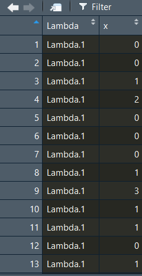
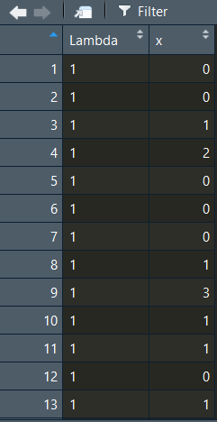

# Probability into R

```{r, include = FALSE, echo = FALSE}
knitr::opts_chunk$set(error = FALSE, warning = FALSE, message = FALSE,
                      fig.height = 3, fig.width = 6, fig.align = 'center')
```

확률 관련 포스팅에서는 몇 가지 간단한 확률을 **R**을 통해서 증명하고(Some simple probability demonstrations), 정규분포(normal distributions)와 이항분포(binomial distributions)로부터 분위(quantiles)를 얻어내는 방법을 살펴보고자 합니다. 

여기서는 일단 간단하게 정규분포랑 이항분포, 그리고 독립사건과 종속사건만 간단하게 살펴보겠습니다.

  + 분위(Quantiles)에 대해 어떻게 설명할까 고민을 좀 했는데 좋은 블로그 포스팅을 찾아서 참조용으로 링크하겠습니다.
  + 링크는 [여기](https://blog.naver.com/sw4r/221026102874)를 보시면 됩니다. Q-Q Plot 설명하면서 Quantile의 정의도 잘 정리해놓으셨습니다.

그럼 본격적으로 포스팅을 시작하기에 앞서서 항상 그렇듯이 작업 디렉토리를 설정해보겠습니다.

```{r, eval = FALSE}
rm(list=ls()) # 현재 콘솔 창에 저장되어 있는 모든 값과 모델 등을 삭제 
```
```{r}
library(here)
library(knitr)
library(dplyr)
library(tidyverse)
library(kableExtra)
here::here() %>% setwd()
```

## 주사위굴리기 게임!

확률을 공부할 때, 지겹도록 등장하는 놈들이 총 셋이 있습니다. 동전, 카드, 그리고 주사위입니다. 인류는 아마도 이 셋을 만듦으로써 스스로를 괴롭히는 통계학을 발전시켰는지도 모르겠습니다... 일단 주사위 굴리기는 직관적으로 확률과 통계를 이해하기 좋은 방식입니다. 먼저 주사위 하나를 한 번 굴리는 것을 시뮬레이팅하는 함수를 코딩해보겠습니다.

```{r}
die <- as.integer(runif(1, min=1, max=7))
die
```

`die`는 `?runif` 라고 입력하여 살펴보면 `generates random deviates.`라고 기술되어 있는 것을 확인할 수 있습니다. 이어지는 함수를 풀어서 설명하면 다음과 같습니다.: 다음의 결과를 정수의 형태로 저장하라(`as.integer`) $\rightarrow$ 무작위로 다음의 범주 내에서 다른 값을 1번 추출하라 $\rightarrow$ 최소값은 1, 최대값은 6 (1 이상 7미만)을 갖게하라.

그러면 이번에는 두 개의 주사위를 굴려보도록 하겠습니다. 굴리는 횟수는 한 번입니다.

```{r}
dice <- (as.integer(runif(1, min=1, max=7))) +
  (as.integer(runif(1, min=1, max=7)))
dice
```

여기서 `+` 연산자는 부울리안 논리에 따르면 `OR`를 의미합니다. 즉 각 주사위를 한 번씩 랜덤으로 굴려 얻는 값을 더한 결과를 `dice`에 저장하라는 명령입니다. 그럼 이번에는 100번, 1000번, 그리고 100만번을 돌려겠습니다.

```{r}
# 주사위 두 개를 100번 던져보기
dice100 <-  (as.integer(runif(100, min=1, max=7))) +
  (as.integer(runif(100, min=1, max=7)))

# 주사위 두 개를 1,000번 던져보기
dice1000 <-  (as.integer(runif(1000, min=1, max=7))) +
  (as.integer(runif(1000, min=1, max=7)))

# 주사위 두 개를 100만 번 던져보기
dice1M <-  (as.integer(runif(1000000, min=1, max=7))) + 
  (as.integer(runif(1000000, min=1, max=7)))
```

이렇게 시뮬레이팅한 세 결과를 히스토그램으로 살펴보겠습니다.

```{r, fig.height=2.5}
par(mfrow = c(1, 3))
hist(dice1000)
hist(dice100)
hist(dice1M)
```

일단 가시적으로 살펴볼 수 있게 각 코드 이후에 그 결과값의 빈도를 표로 나타내보았습니다. 그리고 그 표를 히스토그램으로 재구성해보았습니다. 역시 `N`이 늘어날 수록 우리(?)가 사랑하는 그 녀석의 모습이 드러나기 시작합니다.

주사위는 1에서 6까지의 한정된 값을 가지고, 두 개를 합쳐서 굴려봐야 2부터 12까지의 한정된(bounded) 값이긴 하지만 이 주사위 굴리기를 통해서 우리는 지난 번 포스팅에서 살펴보았던 것처럼 정규분포(normal distribution)와 표본 크기(n), 혹은 표집(sampling)의 관계를 간접적으로 다시 한 번 살펴볼 수 있습니다.


## 동전 던지기

그럼 이번에는 동전을 한 번 던져보겠습니다. 저는 아직까지 앞면 뒷면 이외에 옆면에도 표기를 지닌 동전을 본 적이 없으니, 여기서의 동전도 앞면과 뒷면이라는 두 개의 값만을 가진다고 가정하겠습니다. 삼면이나 사면을 가진 동전을 보신 분들은 부디 댓글로 알려주시길... 나와라 검은 백조야(김웅진 · 김지희 2012, p.53).

아무튼 앞면과 뒷면이 있는 경우에 그 각각이 나올 확률은 0.5, 0.5라고 할 수 있습니다. `rbinom()`은, randomly [drawn] binomial, 무작위로 이항변수를 추출하라는 함수라고 할 수 있습니다. 백문이 불여일코드.

```{r}
coin <- rbinom(1, 1, .5)
coin
```

이어지는 함수를 풀어서 설명하면 다음과 같습니다.: 이항변수로 무작위로 추출하라(`rbinom()`) $\rightarrow$ 1번 추출하라 $\rightarrow$ 최대값은 1 (=최소값은 0) $\rightarrow$ 추출확률은 0.5. 즉, 1이 나올 확률을 50\%로 설정하여 무작위로 추출하라는 것입니다. 그럼 이번에는 100개의 동전을 던져보겠습니다.

```{r}
# 동전 100개 던지기
coin100 <- rbinom(100, 1, .5)
coin100 %>% table() %>% kable()

#동전 1000개 던지기
coin1000 <- rbinom(1000, 1, .5)
coin1000 %>% table() %>% kable()

par(mfrow = c(1, 2))
hist(coin100)
hist(coin1000)
```

이와 같이 이항변수는 나뉘어진(discrete) 값을 가집니다. 히스토그램으로 그리면 0이 나오는 빈도랑 1이 나오는 빈도만 보여주는 것이지요. 이번에는 100개의 동전을 1000번 던지는 경우를 시뮬레이팅해보겠습니다.

```{r}
coin1Mx <- rep(NA, 1000000)
for(i in 1:1000000){
coin1Mx[i] <- sum(rbinom(100, 1, .5))
}
hist(coin1Mx, 
     freq = FALSE, 
     main = "Distribution of heads\n in 100 coin tosses", 
     xlab = "Number of heads")
```

100만 개의 셀을 결측치(`NA`)로 갖는 텅빈 `coinMx`라는 벡터를 만들어보겠습니다. 그리고 `i`가 1에서 100만까지 반복되는 `loop`를 구성합니다. `coin1Mx_1`부터 `coin1Mx_1000000`까지 총 100만개의 `coin1Mx_n`들은 모두 100개의 동전을 던져서 앞면(1)이 나오는 경우의 수를 더한 각각의 값을 가질 것입니다. 따라서 `coin1Mx`는 100만개의 요소를 지닌 벡터입니다.

이 자료를 활용해서 만약 100개를 던졌을 때, 앞면이 60번 나오는 것이 과연 극단적인 확률일지 아니면 무던한 것일지 확인해보겠습니다자. 60번 이상 앞면이 나온 경우를 세는 함수를 짜보겠습니다.

```{r}
table(coin1Mx[coin1Mx > 60])
coin1Mx[coin1Mx > 60] %>% table() %>% t() %>% kable()
```

앞면이 나오는 빈도가 61번 이상부터는 점차 감소하는 것을 확인할 수 있습니다. 그렇다면 이번에는 앞면이 60번 넘게 나올 확률을 구해보겠습니다.

```{r}
length(coin1Mx[coin1Mx > 60])/length(coin1Mx)
sum(table(coin1Mx[coin1Mx > 60]))/1000000
```

`length()`는 `count()`랑 같은 개념이라고 할 수 있습니다. 전체 `coin1Mx`의 수, 즉 100만 건 중에서 앞면이 60번보다 많이 나온 경우의 수가 어느 정도인지를 계산한 것입니다. 즉, 앞면이 60번보다 더 많이 나올 확률은 매우 작다고 할 수 있습니다다. 앞면이 60번 초과하여 나올 확률은 "평균적" or "일반적"인 것은 아니라는 뜻입니다.

## 독립사건 시뮬레이션

두 개의 독립적인 사건을 시뮬레이션해보겠습니다. 첫 번째 함수는 `rand1`이라는 자료에 최소값 0, 최대값 10 미만의 값을 가지는 100개의 수를 무작위로 담으라는 명령입니다. 두 번째 함수는 정규분포를 따라 평균이 0이고 표준편차가 2의 값을 갖는 분포에서 100개의 값을 무작위로 추출해 rand2라는 자료에 담으라는 명령입니다.

  + 일단 보면 `rand2`의 경우, 비록 명령으로 평균을 0으로 하라고 설정했지만 무작위 추출 결과 100개의 값의 평균은 0보다 약간 큰 것을 확인할 수 있습니다.
  + 이제 두 값을 각각 `x`축, `y`축으로 설정하여 100개의 값을 좌표에 매칭시킨 그래프로 나타내보겠습니다.


```{r}
rand1 <- runif(100, min = 0, max = 10)
summary(rand1)
rand2 <- rnorm(100, mean = 0, sd = 2)
summary(rand2)
plot(rand1, rand2)
```

결과적으로 이 그래프에서 우리는 `rand1`과 `rand2` 간에는 어떠한 경향성을 발견하기 힘듭니다. 즉, 독립적이라는 것은 두 변수 간에 어떠한 관계를 상정할 수 없다는 것으로 이해할 수 있습니다.

## 종속사건 시뮬레이션

이번에는 두 사건이 종속적 관계에 있는, 즉 한 사건에서의 변화가 다른 사건에 영향을 미치는 경우를 시뮬레이션해 보겠습니다.

```{r}
rand3 <- 4 + 0.75 * rand1 + rnorm(100, mean = 0, sd = 2)
```

`rand3`는 아까 만들어놓은 `rand1`에다가 0.75를 곱해서 4를 더한 100개의 값에다가 사실 상 `rand2`와 같은 방식으로 구한 값을 더하여 구한 자료입니다. 즉, 이 값은 `rand1`의 값에 어떠한 조치를 취하여 얻은 값이므로 `rand1`에 영향을 받은 결과물이라고 할 수 있습니다. 이렇게 구한 `rand3`와 `rand1` 간의 관계를 그래프로 나타내봅시다.

```{r}
plot(rand1, rand3)
```

이 그래프의 해석은 나중에 산포도(scatter plot) 및 단순회귀분석(simple regression)을 살펴볼 때 다시 한 번 다룰 것입니다. 일단 여기서는 `rand1`이 증가할 때, `rand3`도 증가세를 보이는---둘의 인과적 관계는 확인할 수 없지만 아무튼---양(positive)의 관계를 보이고 있다는 것을 알 수 있습니다. 

`cor(rand1, rand3)`로 두 변수 간의 상관계수를 구해보면[^4-1], 양수의 기울기를 얻게 됩니다.

[^4-1]: 뒤의 `rnorm()`을 이용하여 무작위로 생성한 100개의 값을 구했기 때문에, 이 결과는 구할 때마다 달라질 것입니다.

이번에는 보다 더 불확실성을 가지는 종속사건의 관계를 시뮬레이션해보겠습니다. 여기서 말하는 불확실성은 더 큰 표준편차를 의미합니다. 

  + 표준편차가 평균에서 각 관측치가 떨어져 있는 거리의 평균이라고 할 때, 
  + 표준편차 값이 크다는 것은 개별 값들이 평균에서 더 넓게 분포해 있다는 것을 의미합니다.

```{r}
rand4 <- 4 + 0.75 * rand1 + rnorm(100, mean = 0, sd = 5)
plot(rand1, rand4)
cor(rand1, rand4)
```


`rand1`과 `rand4`의 산포도는 좀 더 넓게 퍼진 모양새를 보이고 둘의 상관관계는 식에서 상정한 0.75라는 기울기에서 0.456으로 더 낮아지는 것을 확인할 수 있습니다.

## 분포(Distribution)

통계분석에 앞서서 일반적으로 알아두어야 할분포 함수(distribution functions)를 살펴보겠습니다. 먼저, 정규분포(normal distributions)와 이항분포(binomial distributions)로부터 분위(quantiles)를 얻어내는 방법을 살펴보겠습니다.

### 정규분포 (The normal distribution)

```{r}
pnorm(70, mean = 50, sd = 10, lower.tail = TRUE)
pnorm(70, mean = 50, sd = 10, lower.tail = FALSE)
1 - pnorm(70, mean = 50, sd = 10, lower.tail = TRUE)
```

첫번째 코드는 50을 평균으로 하고 10을 표준편차로 하는 정규분포가 있을 때, 그 분포에서 70이라는 숫자는 어디에 위치하는지를 묻는 것입니다.

두 번째도 동일한 의미인데, 두 식의 차이는 `lower.tail` 옵션을 어떻게 설정하느냐에 달려있습니다.

  + 각 식이 도출한 결과를 보면 이해하시겠지만 근본적으로 두 식은 동일하며, 좌측에서 누적확률을 계산할 것인지 우측으로부터 계산할 것인지의 차이일 뿐입니다. 
  + 간단하게 말하면 첫 번째 식은 70이라는 숫자는 이 분포에서 하위 97.7\%에 위치한 값이다라고 말하는 것이고 두 번째 식은 상위 2.2\%라고 말하는 것입니다. 
  + 따라서 두 번째 식은 전체 확률에서 첫 번째 식으로 계산한 확률을 제한 값과 같으므로 세 번째의 형태로 계산할 수도 있습니다.

그렇다면 만약에 양측꼬리 확률(two-tailed probability)에서 최소한 70만큼 '극단적인'(extreme) 확률을 얻고 싶을 때는 어떻게 해야할까요? 이 경우는 생각을 좀 달리 해보면 됩니다. 평균을 기점으로 70은 오른쪽 끝쪽에 위치하는 셈입니다. 그만큼 왼쪽 끝에 위치한 값을 상정하고 그 값이 나올 확률을 함께 계산해주어야 합니다. 

이 경우 평균 50에서 70은 20만큼 떨어져 있습니다(우측으로, + 방향). 따라서 우리는 좌측으로 20만큼 떨어진 30이 나올 확률을 함께 고려해주어야 하는 것입니다. 이러한 결과를 얻는 데는두 가지 방법이 존재합니다. 

```{r}
## 첫 번째 방법
pnorm(70, mean = 50, sd = 10, lower.tail = FALSE) + 
  pnorm(30, mean = 50, sd = 10, lower.tail = TRUE)

## 두 번째 방법
2 * pnorm(70, mean = 50, sd = 10, lower.tail = FALSE)
```

그렇다면 이렇게 구한 분포에서의 누적확률 값을 가지고 분위를 구하여 보겠습니다. 마찬가지로 평균 50에 표준편차가 10인 분포를 상정합니다. 이때 사용할 함수는 `qnorm()`입니다.

```{r}
qnorm(0.9772499, mean = 50, sd = 10, lower.tail = TRUE)
```

역으로 계산한 것인데, 평균 50에 표준편차 10인 분포에서 좌측부터 앞서 구한 누적확률에  해당하는 값을 구하라는 명령입니다. 앞에서 우리가 입력한 70과 근사한 값을 얻을 수 있습니다. 근소한 차이는 소수점에 의해 발생하는 것으로 이해하시면 됩니다.

다음으로는 주어진 평균 50, 표준편차 10의 분포에서 70이라는 값이 분포에서 차지하는 밀도를 확인해보겠습니다 밀도(density)를 알아보기 위한 함수는 다음과 같습니다.

```{r}
dnorm(70, mean = 50, sd = 10)
```

그렇다면 이번에는 정규분포에서 관측치를 무작위로 추출(draws)을 해보겠습니다. 이번에도 함수에는 70이라는 값이 사용될 것인데, 여기서 사용되는 70은 특정한 값이 아니라 추출 횟수를 의미합니다.

```{r}
x <- rnorm(70, mean = 50, sd = 10)
x
```

총 70개의 값이 무작위로 추출되어 `x`라는 벡터에 담겨 있는 것을 확인할 수 있습니다.

이번에는 좀 더 구체적으로 정규분포 사례들을 살펴보겠습니다. 서로 다른 평균(mean)과 표준편차(standard deviation)를 가지는 세 개의 정규분포를 그려보겠습니다.

```{r}
normal5 <- rnorm(n = 10000, mean = 5, sd = 3)
normal50 <- rnorm(n = 10000, mean = 50, sd = 10)
normal20 <- rnorm(n = 10000, mean = 20, sd = 1)
```

세 함수 모두 표본의 크기는 1만 개이며, 각자 다른 평균과 표준편차를 따르는 정규분포를 가정하여 무작위로 추출된 값을 담는 벡터로 출력됩니다. 이렇게 값을 갖는 세 개의 벡터를 하나의 데이터로 합쳐보겠습니다. 간단하게 말하면 하나의 표로 합친다는 것과 같습니다.

```{r}
norm <- bind_rows(tibble(x = normal5, Mean = 5, SD = 3),
                  tibble(x = normal50, Mean = 50, SD = 10),
                  tibble(x = normal20, Mean = 20, SD = 1))
norm$Mean <- as.factor(norm$Mean)
```

그리고 이렇게 만들어진 데이터프레임의 평균 값을 `Factor` 자료 유형으로 변환해줍니다. 이것이 의미하는 게 뭘까요? 평균5, 평균50, 평균20을 문자열로 인식하게 하여 일종의 "이름"으로 인식하게 만드는 것입니다. 그러면 이제 이렇게 만들어진 데이터로 그래프를 그려보겠습니다.

```{r}
ggplot(norm, aes(x = x)) +
  geom_density(aes(fill = as.factor(Mean)), adjust = 4, alpha = 1/2) +
  guides(color=guide_legend(title = "Mean, SD")) +
  guides(fill=guide_legend(title = "Mean, SD")) +
  scale_color_discrete(labels = c("5, 3", "20, 1", "50, 10")) +
  scale_fill_discrete(labels = c("5, 3", "20, 1", "50, 10")) +
  ggtitle("Probability Density Function\nNormal Distribution")
```

`ggplot2` 패키지는 **R**에서 그래프를 그리는 데 있어서 유용하게 사용됩니다. 먼저 `ggplot2` 패키지를 불러오고 나서, `ggplot(데이터프레임 이름, aes(x = x축으로 삼을 변수이름))`을 설정하면 일단 수학적으로 지정한 데이터의 변수에 대한 기본적인 작업은 진행이 됩니다. 

그러나 이 단계에서는 아직 가시화(visualization)라고 할 수는 없는데, 주어진 데이터를 컴퓨팅했을 뿐이지 어떻게 가시적인 형태로 보여주라는 명령을 부여하지 않았기 때문입니다. 컴퓨터로 그림을 그려본 사람들은 이해가 쉬운데, `ggplot()`은 레이어 시스템을 이용해서, 우리가 뭔가 그려진 걸 얻고 싶을 때마다 레이어를 하나씩 추가해서 보여달라고 **R**에게 요구해야만 합니다.

그리고 이때, 레이어를 추가하는 것은 `+`로 가능합니다. 하나씩 뜯어서 보면,

  + `ggplot(norm, aes(x = x)) +` : `ggplot2` 패키지를 이용하여 `norm`이라는 데이터 프레임에서 `x`축에는 `x`라는 변수를 기준으로 늘어놓아라. 그리고 뒤에 더해지는 레이어 명령을 덮어 씌워라 라는 의미의 코드입니다.
  + `geom_density(aes(fill = as.factor(Mean)), adjust = 4, alpha = 1/2) +`: 밀도함수의 형태로 그래프를 그리되, `Mean`이라는 `Factor` 변수가 같은 것들 끼리 같은 색으로 칠해서 보여주어라 라는 코드입니다.
    + 뒤의 옵션은 세세한 조정이니 굳이 언급하지는 겠습니다.
    + 뒤에 더해지는 옵션들은 레이어를 추가하여 기존의 코드에 덮어 씌워, 그래프를 덧칠하는 역할을 합니다.
  + `guides(color=guide_legend(title = "Mean, SD")) + guides(fill=guide_legend(title = "Mean, SD")) +`: 우측에 더해지는 레전드의 이름을 어떻게 지으라는 명령입니다. 
    + 이 경우에는 색도 있고 그래프를 선명하게 보여주는 선도 있기 때문에 그 각각이 레이어를 이루고 있어 둘 모두에게 이러한 명령어를 적용해야 합니다.
  + `scale_color_discrete(labels = c("5, 3", "20, 1", "50, 10")) +  scale_fill_discrete(labels = c("5, 3", "20, 1", "50, 10")) +`: `color`와 `fill`을 뒤에 이어지를 라벨로 구분해주라는 코드입니다.
  + ggtitle(`Probability Density Function\nNormal Distribution`) : 표 전체의 이름을 지정하는 명령어이고, `\n`은 **R**에서는 강제 개행(enter)하는 명령어입니다.


### 이항분포 (Binomial distribution)

이항분포는 우리에게 `n`번의 시행에서 `k`번 성공할 확률을 보여주는 분포입니다. 단순하게 말하자면 0과 1의 값만 갖는다고 가정된 벡터가 있다고 하겠습니다. 이때 벡터의 요소의 총 개수는 100개이고 랜덤으로 0과 1 중 하나가 벡터에 들어간다고 할 수 있습니다. 이때 전체 요소의 수 100개 중 1이 뽑혔을 경우를 계산하면 결국 1을 뽑을 성공 사례의 총합을 100으로 나눔으로써, 전체 대비 성공의 확률을 구하는 것이라 할 수 있습니다. 즉, 정규분포에서와는 다르게 이항분포에서는 평균(mean)이 아니라 비율(proportion)에 초점을 맞추게 됩니다.

```{r}
pbinom(27, size=100, prob=0.25, lower.tail = TRUE)
```

시도가 성공할 확률을 0.25라고 놓고 시행 횟수를 100번으로 가정한 경우입니다. 즉, 100번 시도했을 때 성공할 확률이 25%인 이항분포를 가지는 데, 실제로는 27번 성공했다고 한다면 누적확률에서 어느 위치에 해당하는지를 묻는 함수입니다. `lower.tail()`이 `TRUE`로 설정되어 있으므로 좌측에서부터 계산한 것입니다. 즉, 27번 성공한 것은 하위 72.2\%, 상위 27.8\%에 해당한다는 것을 알 수 있습니다.

```{r}
qbinom(0.7223805, size = 100, prob = 0.25, lower.tail = TRUE)
```

이렇게 구한 누적확률로 다시금 성공 횟수를 추정해보겠습니다. 정규분포때와 거의 유사합니다. `size = 100`은 서로 독립적인 사건의 시행, 즉 베르누이 시행(Bernoulli trials)의 횟수를 의미합니다. 그렇다면 100번 시도했을 때 27번 성공할 정확한 확률을 구해보겠습니다.

```{r}
dbinom(27, size=100, prob=0.25)
choose(100, 27)*.25^27*(1-.25)^(100-27)
```

두 가지 방법으로 구할 수 있는데, 첫 번째는 **R**에 내장된 기본 함수인 `dbinom()`으로 구하는 것입니다. 두 번째는 `choose()` 함수를 이용해서 구하는 것입니다. 개인적으로는 `dbinom()` 함수가 있는데 굳이 `choose()` 함수 사용법까지 알아야 하나 싶기는 합니다. 그러나 `choose()` 함수로 보여지는 식이 좀 더 직관적으로 이해하기에는 도움이 됩니다.

```{r}
rbinom(27, size=100, prob=0.25)
sd(rbinom(27, size=100, prob=0.25))
```

마지막으로는 0.25의 확률을 가진 100번의 베르누이 시행을 27번을 반복하는 결과를 보여줍니다. 즉, 평균적으로는 100번 시행 중 25번의 성공을 할 것으로 기대되지만, 실제 시행을 27번 해보면 무작위 추출이기 때문에 25를 중심으로 표준편차 4.21의 범위 내에서 여러 값들이 추출되는 것을 확인할 수 있습니다. 무작위로 추출하기 때문에 돌릴 때마다 값은 다르게 나올 것입니다.

다시 한 번, `n`번의 독립적인 베르누이 사건을 시행할 때, `k`번 성공할 확률을 구하는 이항분포로 실습해보겠습니다. 구체적으로 모집단의 성공 확률을 `p`, 모집단의 크기를 `n`으로 특정하겠습니다.

```{r}
binom10 <- rbinom(n = 10000, p = .5, size = 10)
binom50 <- rbinom(n = 10000, p = .5, size = 50)
binom100 <- rbinom(n = 10000, p = .5, size = 100)
```

정규분포와 다르지는 않습니다. 다만 여기서의 `size`는 전체 동전을 던지는 횟수로 이해하면 되고 10,000은 그렇게 동전을 10번, 50번, 100번 던지는 걸 10,000번 반복한다는 의미라고 할 수 있습니다. 그럼 이제 마찬가지로 하나의 데이터프레임으로 세 번의 시도(`binom10`, `binom50`, `binom100`)의 결과를 합쳐주고 그래프를 그려보겠습니다.

```{r}
binom <- bind_rows(tibble(k = binom10, Size = 10), 
                   tibble(k = binom50, Size = 50), 
                   tibble(k = binom100, Size = 100))
binom$Size <- as.factor(binom$Size)

ggplot(binom, aes(x = k)) +
  geom_density(aes(group = Size, color = Size, fill = Size), 
               adjust = 4, alpha = 1/2) +
  ggtitle("Probability Mass Function\nBinomial Distribution")
```

### 포와송 분포 (Poison distribution)

이 포스팅은 주로 **R** 코드에 관한 것이기 때문에 분포에 대한 수리통계적인 설명은 가급적 피하도록 하겠습니다. 포와송 분포는 고정된 대규모 모집단(fixed large population)에서 짧은 시간에 걸쳐서 희소한 사건(rare events)의 발생 횟수를 추정하는 데 용이한 분포입니다. 

포와송 분포에서 그 희소한 사건의 발생 확률은 시간 단위 별 발생의 평균 횟수로 나타나며 그리스어 람다(`Lambda`, $\lambda$)로 표기됩니다. 람다는 평균과 분산을 결정합니다. 

포와송 분포의 확률을 이용해서 우리는 단일 시간 단위에서 `k`라는 희소한 사건을 정확하게 관측할 확률을 기술할 수 있습니다. 나머지는 앞의 정규분포랑 이항분포에서 했던 코드를 기계적으로 반복해서 살펴보는 것과 같습니자. 단, 포와송 분포에서 코드 중에는 이전과 다른 부분이 있으니 그 점만 유의하면 될 것 같습니다.

```{r}
pois1 <- rpois(n = 10000, lambda = 1)
pois2 <- rpois(n = 10000, lambda = 2)
pois5 <- rpois(n = 10000, lambda = 5)
pois20 <- rpois(n = 10000, lambda = 20)
pois <- tibble(Lambda.1 = pois1, 
               Lamnda.2 = pois2,
               Lambda.5 = pois5,
               Lambda.20 = pois20)
```

이번에는 만들어진 `pois`라는 데이터를 `melt()` 함수를 이용해서 다른 변수로 재구성해줄 것입니다. `melt()` 함수는 `reshape2` 패키지에서 로드할 수 있고, `str_extract()` 함수는 `stringr` 패키지에서 로드할 수 있다.

```{r}
library(reshape2)
library(stringr)
pois <- melt(data = pois, 
             variable.name = "Lambda", 
             value.name = "x")
pois$Lambda <- 
  as.factor(as.numeric(str_extract(string = 
                                     pois$Lambda, 
                                   pattern = "\\d+")))
```

아래 그림에서 맨 왼쪽은 처음 만들어진 `pois` 데이터입니다. 두 번째는 `melt()` 함수를 이용해서 `Lambda`라는 변수 아래에 1, 2, 3, 4의 라벨을 길게(long-shape) 합친 것입니다. 그리고 마지막으로는 `Lambda` 변수의 문자열 `Lambda.`을 제외한 라벨 숫자만 남겨놓은 것입니다.

`pois` 데이터             |  `long-shaped pois`             |  `label only`
:-------------------------:|:-------------------------:|:-------------------------:
  |  |  

이렇게 만들어진 포와송 분포의 값들을 하나의 그래프로 만들어서 가시화해볼 수도 있습니다.

```{r}
ggplot(pois, aes(x = x)) +
  geom_density(aes(group = Lambda, 
                   color = Lambda, 
                   fill = Lambda), 
               adjust = 4, alpha = 1/2) +
  ggtitle("Probability Mass Function\nPoisson Distribution")
```

### 음이항 분포 (Negative Binomial Distribution)

음이항 분포는 `n`번째 시도에서 `k`번째에 성공할 확률을 보여줍니다. 음이항 분포는 다음과 같은 네 조건이 충족될 때 유용합니다.
    
  1. 모든 시도는 독립적이다.
  2. 각 시도의 결과는 성공 혹은 실패로 구분될 수 있다.
  3. 성공 확률 (`p`)은 각 시도마다 동일하다.
  4. 마지막 시도는 항상 성공이어야만 한다.
  
여기서 보면 알 수 있듯이, 처음 세 조건은 이항분포와 동일합니다. 세 개의 음이항 분포 결과를 계산하여 세 개의 벡터로 저장하겠습니다. 그리고 이걸 마찬가지로 하나의 데이터로 합칩니다.

```{r}
nbinom1 <- rnbinom(n = 10000, p = .3, size = 1)
nbinom5 <- rnbinom(n = 10000, p = .3, size = 5)
nbinom10 <- rnbinom(n = 10000, p = .3, size = 10)
nbinom <- bind_rows(tibble(x = nbinom1, Size = 1), 
                    tibble(x = nbinom5, Size = 5), 
                    tibble(x = nbinom10, Size = 10))
nbinom$Size <- as.factor(nbinom$Size)
```

포와송이랑 이항분포에서 사용했던 함수들과 거의 유사합니다. 이렇게 만들어진 그래프는 다음과 같습니다.

```{r}
ggplot(nbinom, aes(x = x)) +
  geom_density(aes(group = Size, color = Size, fill = Size), 
               adjust = 4, alpha = 1/2) +
  ggtitle("Probability Mass Function\nNegative Binomial Distribution")
```

### F 분포 (F Distribution)

`rf()`를 통해서 F 분포에서 무작위로 10,000개의 값을 서로 다른 자유도를 이용하여 추출하여 네 개의 벡터에 저장합니다. 이제는 아시겠지만 `rf()`의 `r`은 random을 의미합니다.

```{r}
fa <- rf(n = 10000, df1 = 1, df2 = 50)
fb <- rf(n = 10000, df1 = 5, df2 = 100)
fc <- rf(n = 10000, df1 = 50, df2 = 50)
fd <- rf(n = 10000, df1 = 50, df2 = 500)
f <- bind_rows(tibble(x = fa, DF1 = 5, DF2 = 5), 
               tibble(x = fb, DF1 = 5, DF2 = 10), 
               tibble(x = fc, DF1 = 10, DF2 = 5),
               tibble(x = fd, DF1 = 10, DF2 = 10))
```

이렇게 만들어진 데이터의 결과는 그림과 같습니다. 그리고 이제 `x` 값이 6보다 작거나 같은 경우로 하위 데이터를 만듭니다. 왜냐하면 굉장히 극단적인 수치들이 희소한 확률로 있기 때문에 그냥 그래프를 그리면 집단 별 차이를 보기가 조금 힘들 수도 있기 때문입니다. 그리고 전체 자유도를 지정해줄 것입니다. 자세한 내용은 나중에 `F-distribution`을 언급할 때 설명하도록 하겠습니다.

```{r}
f <- subset(f, x <= 6)
f$DF <- f$DF1 * 100 + f$DF2
f$DF <- as.factor(f$DF)

ggplot(f, aes(x = x)) +
  geom_density(aes(color = DF, fill = DF), adjust = 4, alpha = 1/2) +
  guides(color=guide_legend(title = "DF1, DF2")) +
  guides(fill=guide_legend(title = "DF1, DF2")) +
  scale_color_discrete(labels = c("1, 50", "5, 500", "50, 50", "50, 500")) +
  scale_fill_discrete(labels = c("1, 50", "5, 500", "50, 50", "50, 500")) +
  ggtitle("Probability Density Function\nF Distribution")
```

`DF1`이랑 `DF2`를 합쳐준다는 것은 F-분포의 특징 때문인데, 간단하게 말하자면 t-분포와 다르게 F-분포는 분자, 분모에 자유도가 하나씩 즉 2개가 필요하기 때문입니다.

오늘 포스팅한 내용 중에서는 처음 두 분포, 정규분포와 이항분포에 대해서는 숙지할 필요가 있고 나머지 분포들은 추후에 다시 다룰 기회가 있을 것이라고 생각합니다. 사실 분포는 엄청 많습니다: 웨이블, 토빗... 뭐 여럿 있기 때문에 다 외우는 것은 어렵고 여기서는 단지 R-code로 구현하는 방법을 러프하게 살펴보았다고 할 수 있을 것입니다.

그리고 `ggplot()`은 손에 익도록 연습하는 것이 좋습니다. **R**의 장점 중 하나는 여타의 통계툴들에 비해 그래프 기능이 뛰어나다는 것입니다. `ggplot()`은 **R**이 그러한 명성을 얻게 해 준 공신 중 하나라고 할 수 있습니다.

